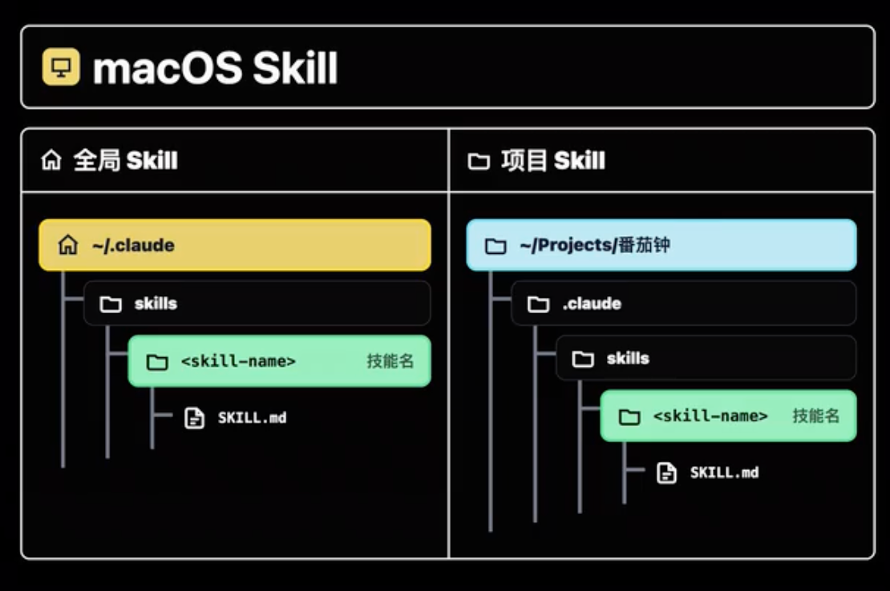
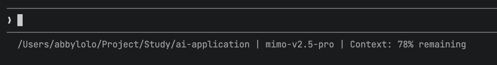

## 一、概念

1. `Claude Code` 是 **运行在本地的** **Harness工程优秀的** **顶尖Agent**
2. 使用方式：桌面端应用、网页端、IDE插件、终端（推荐）
3. `Claude Code` 官网概述（含安装方式）：<https://code.claude.com/docs/en/overview>
4. 使用`cc-switch`多模型管理与切换，用户手册（含安装方式）：<https://github.com/farion1231/cc-switch/blob/main/docs/user-manual/zh/README.md>


## 二、命令

| 命令                                   | 作用                                                | 备注                 |
| ------------------------------------ | ------------------------------------------------- | ------------------ |
| claude --dangerously-skip-permission | 最高权限运行cc                                          | <br />             |
| @具体文件                                | <br />                                            | <br />             |
| /model                               | 切换高中低档模型                                          | <br />             |
| /btw                                 | `By the way`，可以暂时切出临时会话。会话完毕，按`esc`消除临时会话         | <br />             |
| /context                             | 详细展示agent当前的上下文信息，如：上下文占比、上下文类别等                  | <br />             |
| /compact                             | 主动压缩精简上下文                                         | <br />             |
| /clear                               | 清空上下文，相当于重开会话                                     | <br />             |
| /resume                              | 在全新的窗口选择恢复到之前的对话                                  | <br />             |
| /init                                | 初始化创建项目级`CLAUDE.md`                               | 不建议对空项目生成，可以有雏形后生成 |
| /memory                              | 针对Claude的全局、项目记忆，以及auto memory进行操作和管理             | <br />             |
| /simplify                            | 输入后会派生出3个agent，从代码质量、运行效率、复用性三个角度做一次代码审核，然后自动优化修改 | 本质上是内置的skill       |
| /rewind                              | 回滚历史。或者连按两个`esc`                                  | <br />             |
| /skills                              | 查看现有技能                                            | <br />             |
| claude -c                            | 或`claude --continue `  ，继续上一次的会话                  | <br />             |


## 三、个性化设置

> 你是谁？项目在做什么？有什么要求

### 1、CLAUDE.md

> - 第一优先级 全部注入
> - 用户主动确定的规则

- `CLAUDE.md`：
  - 全局级（`/Users/abbylolo/.claude/CLAUDE.md`）
  - 项目级（单独项目规范，项目根目录下）
  - 子文件夹级

[受 Karpathy 启发的 Claude Code 指南](https://github.com/multica-ai/andrej-karpathy-skills/blob/main/README.zh.md)

**选项 A：Claude Code 插件（推荐）**

在 Claude Code 中，首先添加插件市场：

```
/plugin marketplace add forrestchang/andrej-karpathy-skills
```

然后安装插件：

```
/plugin install andrej-karpathy-skills@karpathy-skills
```

这会将指南安装为 Claude Code 插件，使其在你所有项目中可用。

**选项 B：CLAUDE.md（按项目）**

新项目：

```bash
curl -o CLAUDE.md https://raw.githubusercontent.com/forrestchang/andrej-karpathy-skills/main/CLAUDE.md
```

已有项目（追加）：

```bash
echo "" >> CLAUDE.md
curl https://raw.githubusercontent.com/forrestchang/andrej-karpathy-skills/main/CLAUDE.md >> CLAUDE.md
```

### 2、Auto-memory自动记忆

> - 第二优先级 按需加载
> - Agent自主提取记录

**查看方式：** 命令行 /memory  => Auto-memory: on => 3. Open auto-memory folder 查看记忆

1. 用户身份
2. 反馈
3. 项目信息
4. 参考：外部资源的索引

### 3、自行构建

自行写一些规则文件，最终在CLAUDE.md文件中引入使用


## 四、高级扩展

### 1、Skill

- 知识型 —— 前端页面设计规范
- 流程型 —— 公司报销流程指南
- 工具型 —— Nano Banana调用方法
- 混合型 —— 公众号排版制作与发布



- 使用Skill：`/技能名称` 或 使用时自动调取
- 特殊Skill：
  - 找Skill的Skill：`https://github.com/vercel-labs/skills.git 帮我下载find-skills ` &#x20;
  - 创建Skill的Skill：`https://github.com/anthropics/skills/blob/main/skills/skill-creator/SKILL.md`

### 2、MCP

> 重量级使用MCP，轻量级用Skill

### 3、CLI

> Command Line Interface 命令行工具

- OpenCLI

### 4、SubAgent

- 调用方式
  - 主Agent自主调用
  - 手动提示调用
  - 提示主Agent生成并调用

### 5、Hook

> Hook 是一种强大的扩展机制，它允许你在 Claude Code **会话生命周期的特定节点上插入自定义的脚本或命令**。简单来说，Hook 就像一种“事件监听器”，能在特定事情发生时自动触发一个外部操作，并将结果反馈给 Claude，从而干预或增强它的行为
>
> 当CC【xxx】，就自动执行【xxx】

#### 1）与钉钉联动

`帮我做个Hook，你每次完成任务之后，自动发出一个提示音并向我的钉钉发一条消息`

**创建钉钉自定义机器人步骤：**

    1. 打开钉钉群 → 右上角「群设置」→「智能群助手」→「添加机器人」
    2. 选择「自定义」机器人
    3. 配置机器人

    - 填写机器人名称（如：Claude 通知）
    - 安全设置选择「自定义关键词」，填入 任务完成（或你想要的关键词）

    4. 复制 Webhook 地址

    - 创建完成后会显示类似：https://oapi.dingtalk.com/robot/send?access_token=xxxxxxxx

    5. 把 Webhook 地址发给CC，CC来配置 Hook


**效果图：**


## 其他

### 1、配置状态栏

`帮我配一个statusLine,能显示当前目录+模型+上下文剩余百分比的功能   `     &#x20;




